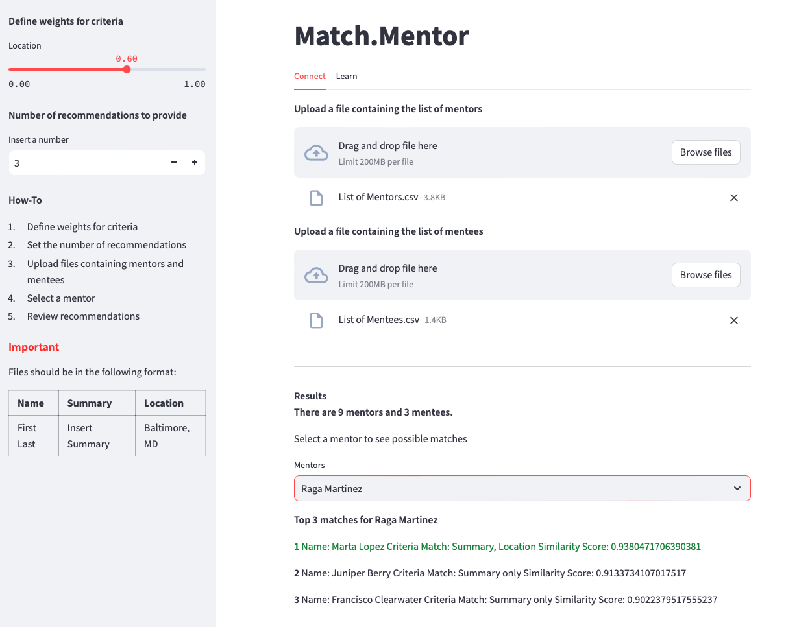

# Mentor Match

[](LICENSE)
[](https://github.com/andGarc/match.mentor/issues)
[](https://github.com/andGarc/match.mentor/stargazers)
[](https://github.com/andGarc/match.mentor/network)



Mentor Match is an application that leverages BERT (Bidirectional Encoder Representations from Transformers) model to facilitate seamless mentor-mentee connections. The app streamlines the process of identifying potential mentees, enabling mentors to discover ideal matches effortlessly based on their unique preferences and criteria.

## Benefits
- Empowers mentors to identify promising mentees efficiently and effectively.
- Facilitates meaningful connections that foster professional growth and development.
- Saves time and effort by automating the process of mentor-mentee pairing.
- Provides tailored and relevant match suggestions.

## Tech Stack
Powered by Python, Streamlit, and BERT Mini. Hosted on OpenShift.
For a complete list of packages used, see the `requirements.txt` file. 

## Features
1. **BERT-Mini**: BERT-powered matching algorithm for accurate and relevant mentor-mentee pairing. 
2. **Criteria Weights**: weights can be assigned to each criterion based on importance. 
3. **Number of Recommendations**: the number of recommendations the model provides can be set with ease. 
4. **Multi-Criterion Highlighting**: highlighted matches include those meeting multiple criteria. 

## Improvements
Potential enhancements:
- Performance Optimization
- UI refinement 
- Integrating a larger BERT model or Few-Shot learning 
- Feature Expansion

## Running the Project

Clone the repository and install the necessary dependencies to get started with Mentor Match.

```bash
git clone https://github.com/andGarc/match.mentor.git
cd match.mentor
pip install -r requirements.txt
```
## Usage
To run locally:
```bash
mkdir bert-mini
python get-model.py
streamlit run Main.py
``````

## Contributing  
### Reporting Issues
If you encounter any issues or have suggestions for improvements, please [open an issue](https://github.com/andGarc/match.mentor/issues). Provide a clear and detailed explanation of the problem, and if possible, include steps to reproduce it.

## License
This project is licensed under the MIT License. See the [LICENSE](LICENSE) file for more details.

## Acknowledgements
Third party libraries and tools:
 - [Streamlit](https://streamlit.io)
 - [scikit-learn](https://scikit-learn.org/stable/)
 - [SentenceTransformer](https://www.sbert.net)
 - [BERT-Mini](https://huggingface.co/prajjwal1/bert-mini)


